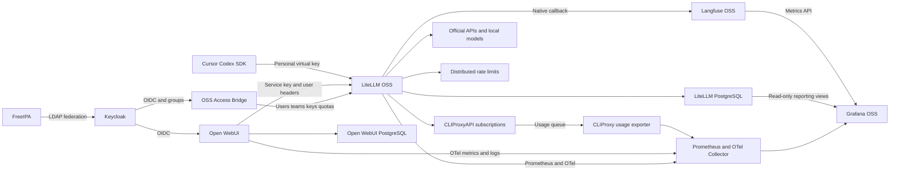

# Централизованная LLM-платформа

## Целевая архитектура

- Использовать существующий CLIProxyAPI только как внутренний upstream. Пользователи не получают его общий ключ напрямую.
- Размещать identity, quotas и observability в этом репозитории; не смешивать их с текущей конфигурацией CLIProxyAPI.
- Keycloak федеративно читает пользователей и группы FreeIPA. Open WebUI и Access Bridge используют единый OIDC login; пользовательский вход в платный LiteLLM SSO не используется.
- LiteLLM OSS публикует основной endpoint `/v1`, маршрутизирует модели, применяет virtual-key/user/team budgets и RPM/TPM и хранит usage.
- Open WebUI использует внутренний service key и передаёт `X-OpenWebUI-User-Id`, `X-OpenWebUI-User-Email`, `X-OpenWebUI-Chat-Id`. Внешний proxy удаляет такие заголовки у недоверенных клиентов.
- Langfuse OSS получает traces через native LiteLLM callback с prompt, response, identity, token usage и latency. Open WebUI chat ID преобразуется в Langfuse session ID отдельным filter/pipeline.

## Граница готового OSS и собственного кода

- Готовые бесплатные компоненты закрывают каталог, SSO, чат, gateway, virtual keys, quotas, routing и tracing.
- Access Bridge реализует только недостающий lifecycle: OIDC login, group-to-team/quota mapping, создание/отзыв собственных keys, usage view и offboarding reconciliation.
- Access Bridge показывает пользователю простые progress bars: личный месячный лимит, лимит каждого ключа, доступный командный лимит и общий platform/provider pool — только `использовано %`, `осталось %` и время reset.
- Использовать стабильный Keycloak `sub` как canonical external identity; email хранить только как отображаемый атрибут.
- Профили групп FreeIPA (`llm-basic`, `llm-coding`, `llm-pro`, `llm-admin`) хранить как versioned YAML policy в репозитории.
- Не использовать LiteLLM Enterprise SSO, SCIM, JWT auth, organizations, audit add-ons или Bifrost Enterprise.
- New API не использовать как второй gateway: его готовый портал не компенсирует отсутствие требуемых team RPM/TPM и штатного Langfuse/OTel, а двойной gateway усложнит accounting.
- Access Bridge не реализует собственный LLM proxy, rate limiter, budget engine или trace storage; privileged LiteLLM master key остаётся только в backend.

## Квоты и маршрутизация

- Применять ограничения LiteLLM OSS на уровнях user/team member, team и virtual key; ключ может только ужесточать родительский лимит.
- Для каждого профиля задать model allowlist, monthly credits, RPM, TPM, max parallel requests и максимальный TTL ключа.
- Для подписок CLIProxyAPI использовать внутренние credits по контролируемой таблице условной стоимости, а не представлять их как фактические расходы провайдера.
- Включить fail-closed budget enforcement и Redis-backed rate limiting; превышение возвращает `429` без обращения к upstream.
- Сохранить возможность направлять отдельные модели напрямую в официальные API или локальные endpoints, обходя пул подписок, но не LiteLLM.

## Capacity model для подписок

- Не считать consumer-подписки гарантированной production-capacity: у Claude Max и ChatGPT Pro есть динамические скрытые weekly limits без SLA, а Cursor Ultra не предоставляет raw OpenAI-compatible endpoint.
- Shared-capacity consumer-подписок для нескольких пользователей считать равной нулю: Anthropic запрещает routing через Free/Pro/Max credentials от имени других пользователей, OpenAI запрещает shared account credentials, Cursor запрещает proxy к приватным endpoints.
- Claude Max 20x и ChatGPT Pro 20x использовать только в персональных нативных coding workflows владельца, не в общем LiteLLM/CLIProxyAPI пуле.
- Cursor Ultra исключить из upstream-модели полностью; допустимы только Cursor IDE/CLI/SDK с agent harness конкретного владельца.
- Production capacity общего `/v1` рассчитывать по официальным API rate limits, prepaid budget и локальным моделям; consumer subscriptions могут быть только внеплатформенным персональным дополнением.
- Для отказоустойчивости настроить official API/local-model fallback и не обещать пользовательские квоты выше гарантированного API budget.

## Внутренний денежный эквивалент

- Считать каждый model call по фактическим `input_tokens`, `cache_write_tokens`, `cache_read_tokens` и `output_tokens`, умноженным на публичный API rate card соответствующей модели.
- Использовать этот расчёт как shadow cost даже для локальных моделей и персональных subscription experiments; он не является фактическим счётом провайдера.
- Принять `1 internal credit = $0.01` API-equivalent и хранить одновременно исходные токены, рассчитанные USD и credits.
- Не назначать фиксированную цену пользовательскому prompt: один Agent turn может породить 5–20 и более model calls.
- До накопления собственной телеметрии использовать baseline одного coding call `20k input + 4k output`; после пилота заменить baseline на p50/p90 по модели, source и типу клиента.

## Хранение и аудит

- Open WebUI PostgreSQL — пользовательские треды, ветки, вложения и knowledge-base metadata.
- LiteLLM PostgreSQL — users, teams, virtual keys, budgets и spend logs.
- Langfuse persistent storage — все обращения через `/v1`, включая coding agents и скрипты; настроить retention, backup, TLS и шифрование дисков.
- Для WebUI связывать generations в Langfuse по `X-OpenWebUI-Chat-Id`; для coding agents сохранять каждый вызов и группировать в session только при наличии metadata от клиента/wrapper.
- Не добавлять отдельный immutable S3/MinIO-архив в первую версию; предусмотреть его позже для compliance/WORM требований.

## Метрики и Grafana OSS

### Источники данных

- Scrape защищённого LiteLLM `/metrics` в Prometheus; импортировать поддерживаемые LiteLLM Grafana dashboards и дополнить своими панелями.
- Экспортировать GenAI OTel metrics через OpenTelemetry Collector: request duration, provider duration, TTFT, time per output token, input/output tokens и calculated USD.
- Включить Open WebUI OTel metrics/logs для HTTP latency, error rate, SQLAlchemy/Redis latency и связанного trace ID.
- Подключить node-exporter, PostgreSQL exporter, Redis exporter и ClickHouse metrics для инфраструктурной ёмкости.
- Реализовать небольшой CLIProxy usage exporter, который единственным consumer читает Redis usage queue и экспортирует bounded metrics по provider/model/auth index/status. Не экспортировать raw API keys или OAuth metadata.
- Для trace-level аналитики использовать Langfuse UI и Metrics API v2; прямые запросы Grafana к внутренним ClickHouse-таблицам не считать стабильным контрактом.

### Cardinality и приватность

- В Prometheus разрешить только bounded labels: `model`, `requested_model`, `provider`, `team`, `status_code`, `service_tier`, `source`.
- Не помещать `email`, prompt, response, raw user ID, chat ID, request ID или API key в Prometheus labels.
- Per-user отчёты строить в Grafana через read-only reporting views над LiteLLM daily rollups либо через периодический импорт официальных spend APIs в отдельную reporting schema.
- Использовать canonical opaque Keycloak `sub` в reporting tables; email резолвить только при отображении авторизованному администратору.
- Grafana с пользовательскими данными сделать admin-only. Собственный расход пользователь видит в Access Bridge; Grafana OSS не использовать как механизм row-level authorization.

### Пользовательский индикатор лимитов

- В Access Bridge дать отдельную страницу `Usage`, не требующую доступа к Grafana.
- Показывать четыре независимые шкалы: `Personal monthly`, `Selected key`, `Team shared` и `Platform/provider pool`.
- Для каждой шкалы отображать только округлённые проценты used/remaining, статус `normal`/`warning`/`critical` и точное время следующего reset; абсолютные деньги и потребление других пользователей не раскрывать.
- Platform/provider pool считать по внутренним credits и доступной upstream telemetry. Если провайдер не сообщает полный лимит, показывать `unknown`, а не выдуманный процент.
- При нескольких одновременно действующих ограничениях явно выделять самое близкое к исчерпанию и объяснять, какое ограничение заблокирует следующий запрос первым.
- Обновлять пользовательские значения не реже одного раза в минуту; для расчёта использовать серверные агрегаты Access Bridge, не прямой доступ браузера к LiteLLM master routes или monitoring databases.
- Пользователь видит только собственные keys и разрешённый агрегат команды/platform; идентификаторы, расходы и активность других пользователей не возвращаются API.

### Дашборды

1. **Platform health:** availability, requests/sec, in-flight requests, p50/p95/p99 gateway overhead, TTFT, provider latency, 4xx/5xx/429, retries и failovers.
2. **Provider capacity:** tokens/min, requests/min, concurrency, cache hit ratio, model mix, calculated API-equivalent USD, CLIProxy auth health, quota/cooldown events и reset timestamps, где upstream их сообщает.
3. **User and team usage:** calls, input/output/cache tokens, shadow USD, internal credits, budget used/remaining, projected exhaustion date, active days и top models по user/team/key/source.
4. **Open WebUI adoption:** DAU/WAU, chats, assistant messages, tokens, model/tool usage и latency; содержимое диалогов в Grafana не показывать.
5. **Identity lifecycle:** Keycloak sync lag, users by quota profile, provisioning failures, orphan keys, disabled users with active keys и last successful reconciliation.
6. **Observability pipeline:** Langfuse ingestion lag/errors, CLIProxy queue backlog/drops, OTel export failures, Prometheus scrape health и reporting freshness.
7. **Storage and recovery:** PostgreSQL/ClickHouse size and growth, Redis memory/evictions, backup age, last restore test и estimated days to disk exhaustion.

### Alerts и SLO

- Alert при 5xx > 5% за 5 минут, 429 > 10%, резком росте TTFT/provider latency, unhealthy CLIProxy credential или отсутствии healthy upstream для разрешённой модели.
- Alert при user/team budget < 20%, projected exhaustion раньше reset, subscription experiment > 80% weekly/session limit и расхождении token accounting между LiteLLM и CLIProxy.
- Alert при provisioning/reconciliation lag > 15 минут, orphan key, active key заблокированного пользователя или неуспешном revoke.
- Alert при Langfuse/OTel ingestion lag > 5 минут, CLIProxy queue loss, backup age > 24 часов и disk forecast < 14 дней.
- Целевой gateway availability начать с 99.5%; измерять proxy overhead отдельно от upstream model latency и формировать отдельные SLO по model/provider.
- Хранить raw Prometheus series 30 дней, daily per-user/team rollups минимум 12 месяцев; prompts/responses подчинять отдельной retention policy Langfuse.

## Проверка

- Проверить OIDC-вход пользователя FreeIPA в Open WebUI и Access Bridge, а также синхронизацию групп в LiteLLM OSS.
- Проверить model ACL и независимые лимиты для WebUI-пользователя, персонального agent key и team.
- Доказать, что подмена `X-OpenWebUI-*` извне невозможна и общий service key не позволяет обойти end-user quota.
- Прогнать chat completions, streaming, Responses API, tool calls и типичный Codex/Cursor запрос через LiteLLM OSS → CLIProxyAPI.
- Проверить `429`, отзыв ключа, удаление из FreeIPA, upstream failover и полные success/failure traces в Langfuse.
- Сверить tokens и shadow cost одного набора запросов между LiteLLM, CLIProxy usage queue, Langfuse и per-user Grafana report; определить допустимую погрешность.
- Нагрузочно проверить cardinality Prometheus и доказать отсутствие PII/secrets в metrics и logs.
- Проверить все critical alerts синтетическими отказами без мутаций production-среды.
- Проверить backup/restore, upgrade и rollback бесплатного стека и восстановление reconciliation после недоступности Keycloak или LiteLLM.
